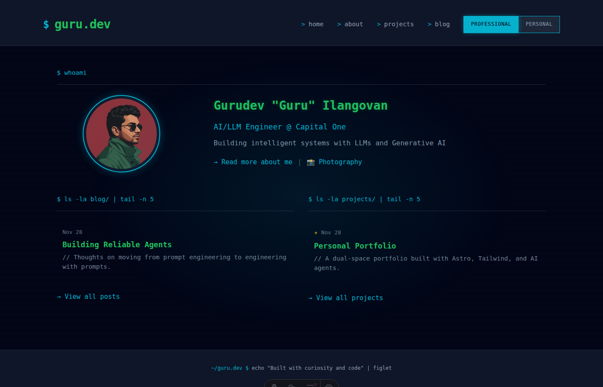
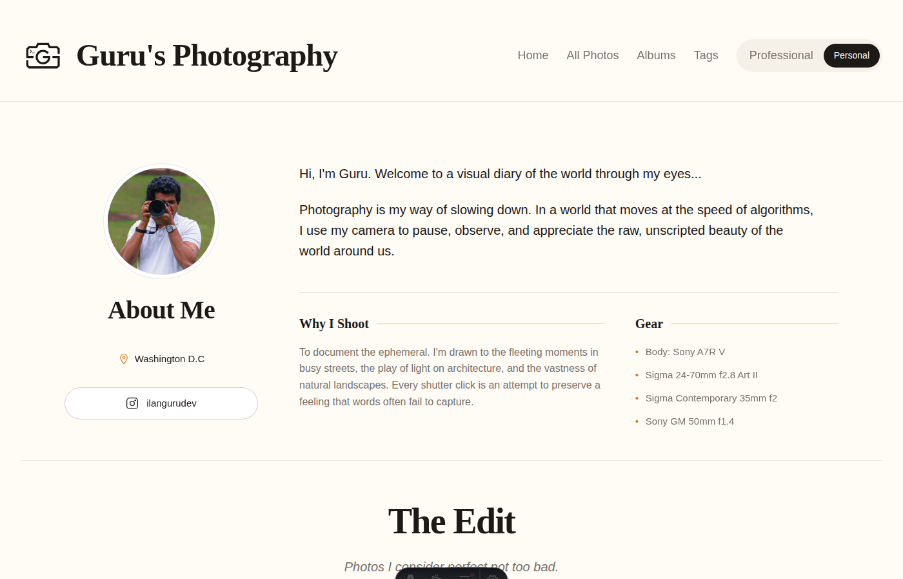
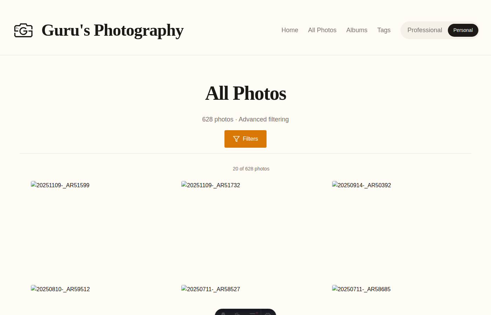
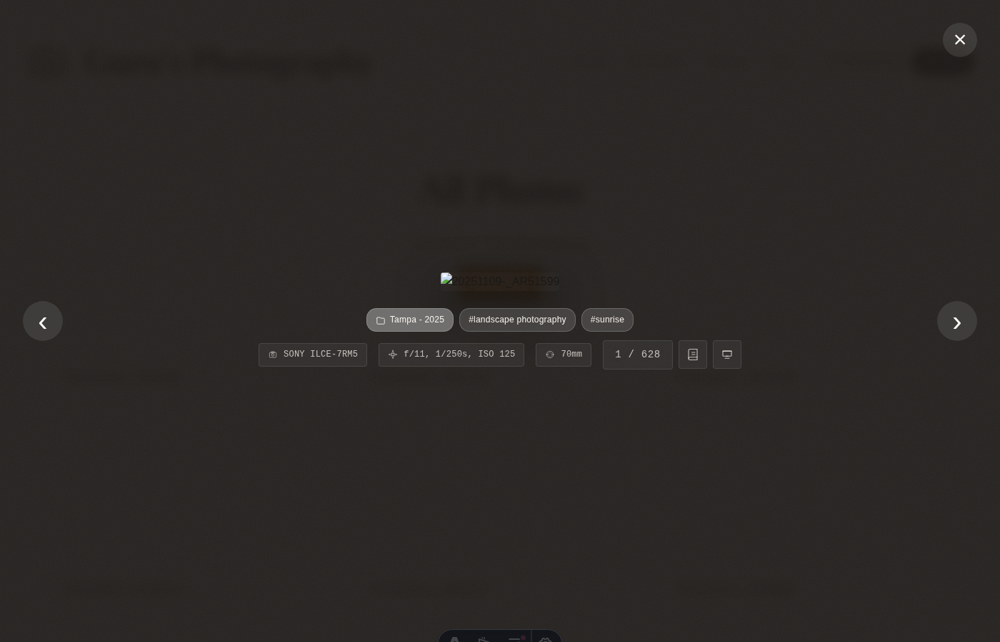
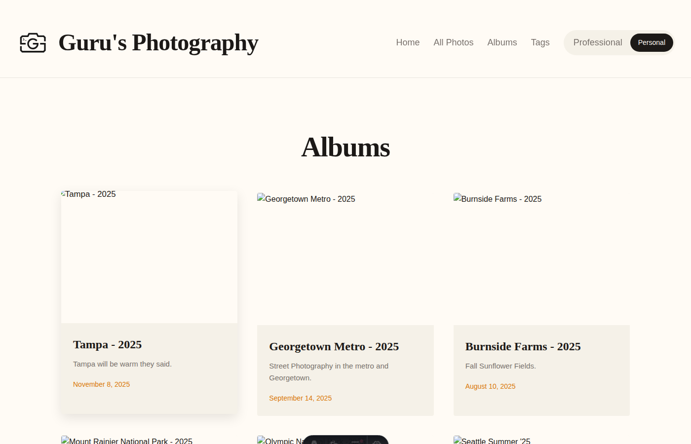
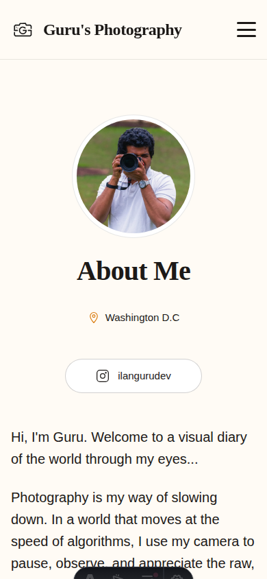

# Guru's Portfolio

A dual-space portfolio showcasing two distinct identities: **AI/LLM Engineering** and **Photography**. Built with Astro, powered by AI-driven development.



## Dual-Space Design

Two completely separate aesthetics under one roof:

| **Professional Space** (`/`) | **Photography Space** (`/photography`) |
|------------------------------|----------------------------------------|
| Dark terminal "hacker" theme | Light editorial cream theme |
| Monospace typography | Serif/sans-serif pairing |
| Cyan/green/yellow accents | Amber/terracotta warmth |
| Blog posts & projects | Photo galleries & albums |



## Key Features

### Advanced Photo Gallery

**628+ photos** with an 8-dimensional filtering system:

- **Tags** - Multi-select with AND/OR logic toggle
- **Albums** - Filter by photo collection
- **Cameras** - Filter by camera model
- **Date Range** - Min/max date pickers
- **Aperture** - Dual-range f-stop slider
- **Shutter Speed** - Dual-range slider
- **ISO** - Dual-range slider
- **Focal Length** - Dual-range mm slider



### Full-Featured Lightbox

- Keyboard navigation (arrows, escape)
- Touch swipe gestures for mobile
- **Slideshow mode** with configurable intervals (1s, 3s, 5s, 10s, 60s)
- **Story drawer** - Slide-up panel for photo descriptions
- Rich EXIF metadata display (camera, settings, focal length, location)
- Film counter ("5 / 42")
- Preloading for instant navigation



### Albums & Organization

Photos organized into themed albums with:
- Cover photos and descriptions
- Featured album highlighting
- Per-album tag filtering
- Custom sort ordering



### Responsive Design

Fully responsive across all devices:
- Adaptive column grids (1-3 columns)
- Mobile-optimized lightbox with expandable metadata
- Touch-friendly controls
- Hamburger menu with space toggle



## Technical Architecture

### Performance-First

- **Infinite scroll** - Batch loading (20 photos/batch) via Intersection Observer
- **CDN + Image Resizing** - Cloudflare R2 with automatic resizing (`/cdn-cgi/image/width=400,quality=85`)
- **Zero-JS by default** - Astro islands hydrate only interactive components
- **Responsive thumbnails** - Optimized for viewport size

### Content-Driven

All content managed via Markdown with Zod-validated schemas:

```
src/content/
├── albums/       # Album metadata
├── photos/       # Photo records with EXIF
├── blog/         # AI/engineering articles
└── projects/     # Portfolio projects
```

### Cloud Infrastructure

- **Cloudflare R2** - S3-compatible storage for photos
- **Cloudflare Image Resizing** - On-the-fly optimization
- **Netlify** - Static site deployment

## Scripts & Workflows

### Photo Import
```bash
npm run import ~/path/to/photos
```
- Extracts EXIF/IPTC metadata automatically
- Copies to local + uploads to R2
- Generates batch markdown for review

### Photo Removal
```bash
npm run remove -- --album album-name --dry-run
npm run remove -- --photo album/filename
```

### Development
```bash
npm run dev              # Start dev server
npm run build            # Production build
npm run test             # Run all E2E tests
```

## AI-Driven Development

This entire codebase was built using **AI agents** with organized documentation:

```
AGENTS.md                    # Root project overview
├── src/AGENTS.md            # Core architecture & schemas
├── src/components/AGENTS.md # UI components documentation
├── src/layouts/AGENTS.md    # Theme system & styles
├── scripts/AGENTS.md        # Workflow documentation
├── src/utils/AGENTS.md      # Helper functions
└── tests/AGENTS.md          # Testing guide
```

Each `AGENTS.md` file provides context for AI assistants to understand and modify specific parts of the codebase effectively.

## Comprehensive E2E Testing

**17+ Playwright test suites** covering:

| Test Suite | Coverage |
|------------|----------|
| `dual-space-navigation` | Professional/Photography switching |
| `photo-filter-toggle` | Filter UI interactions |
| `tag-filtering-and-or` | AND/OR logic, availability |
| `lightbox-interactions` | Open/close/navigation/keyboard |
| `slideshow-mode` | Auto-advance, intervals |
| `infinite-scroll` | Lazy loading, batch loading |
| `advanced-filters` | All 8 filter dimensions |
| `story-drawer` | Photo descriptions |
| `responsive-design` | Mobile/tablet/desktop |
| `album-pages` | Album listing & detail |

```bash
npm test                    # Run all specs in parallel
npm run test:lightbox       # Run specific suite
npm run test:filters        # Run filter tests
```

## Tech Stack

- **Framework:** Astro 5.x (SSG)
- **Styling:** Tailwind CSS 4.x
- **Interactivity:** React 18.x (islands)
- **Images:** Sharp + exifr (EXIF extraction)
- **Storage:** Cloudflare R2
- **CDN:** Cloudflare Image Resizing
- **Testing:** Playwright
- **Deployment:** Netlify

## Quick Start

```bash
# Install dependencies
npm install

# Start development server
npm run dev

# Run tests
npm test

# Build for production
npm run build
```

---

Built with curiosity and code by [Guru Ilangovan](https://guru.dev)
