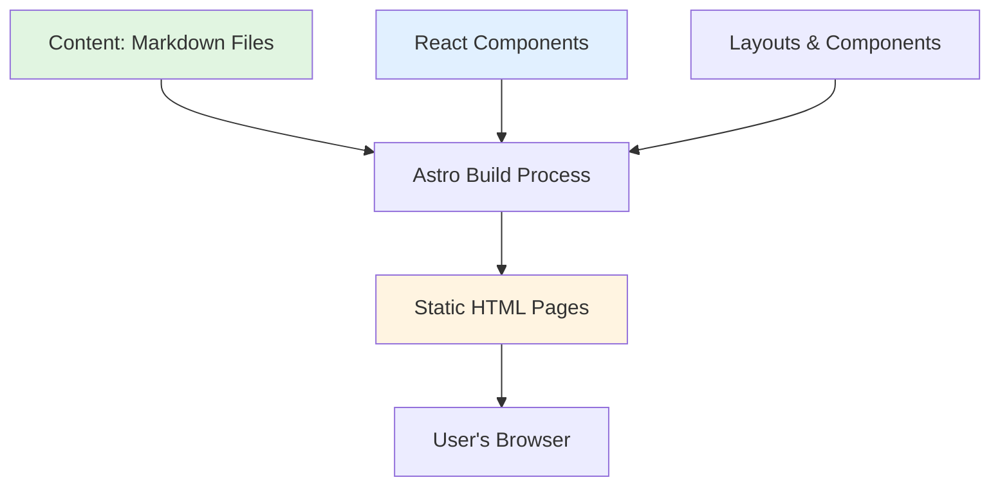
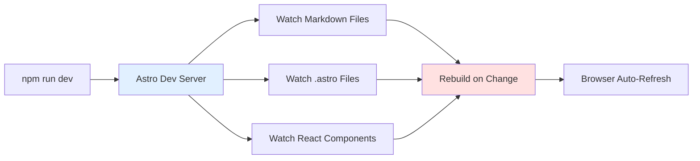
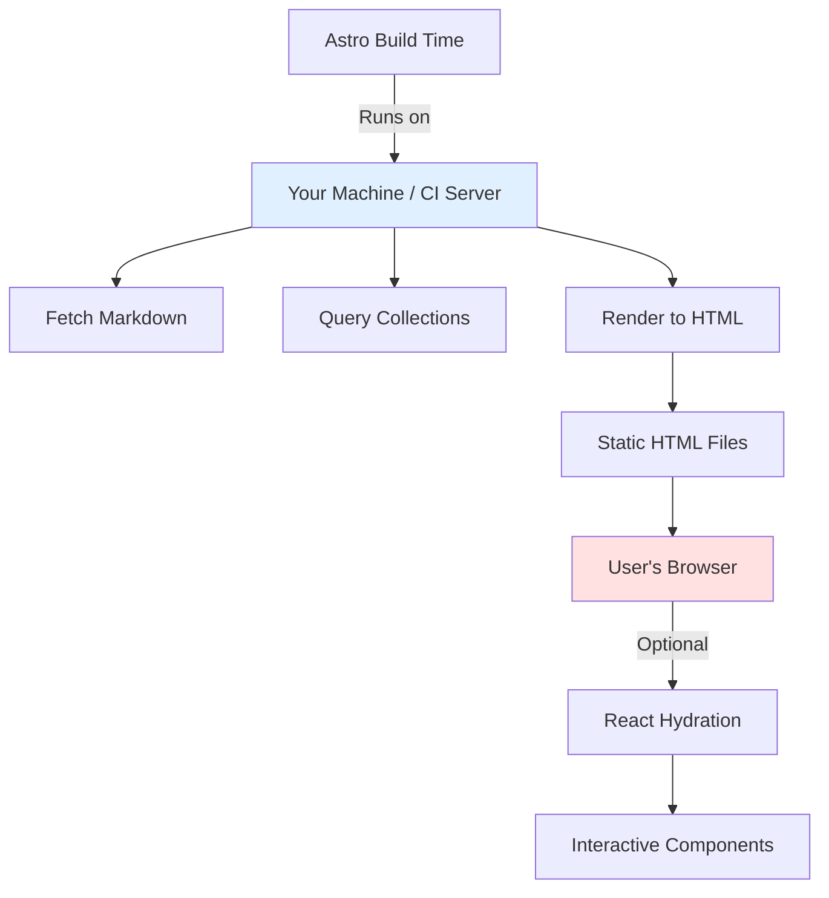

# Personal Portfolio Tutorial

> A comprehensive guide to understanding this Astro-based dual-space portfolio website, written for Python developers learning the JavaScript/TypeScript ecosystem.

---

## Table of Contents

1. [The Problem & Solution](#1-the-problem--solution)
2. [Understanding the Tech Stack](#2-understanding-the-tech-stack)
3. [Project Structure Overview](#3-project-structure-overview)
4. [The Content Layer: Markdown to Data](#4-the-content-layer-markdown-to-data)
5. [The Rendering Pipeline](#5-the-rendering-pipeline)
6. [Routing & Navigation](#6-routing--navigation)
7. [The Dual Aesthetic System](#7-the-dual-aesthetic-system)
8. [Photo Organization & Display](#8-photo-organization--display)
9. [Advanced Features](#9-advanced-features)
10. [Server-Side vs Client-Side](#10-server-side-vs-client-side)
11. [Practical Exercises](#11-practical-exercises)

---

## 1. The Problem & Solution

### The Problem

You want to showcase **two distinct identities** in one website:
- **Professional Space**: AI blog, projects, learnings → Terminal "hacker" aesthetic
- **Photography Space**: Street/landscape portfolio → Bright editorial aesthetic

These two spaces should feel completely separate, with no mixing of aesthetics or content.

### Why a JavaScript Framework?

**Static vs Dynamic Trade-offs:**
- **Pure HTML/CSS**: Simple but repetitive. Adding a new blog post means hand-writing HTML, duplicating navigation, etc.
- **Server-Side Frameworks** (like Django/Flask): Great for dynamic content, but overkill for a personal site. Requires a running server, database, higher hosting costs.
- **Static Site Generators** (like Pelican for Python): Perfect middle ground! Write content in Markdown, generate HTML at build time.

**But Why JavaScript Instead of Python?**
- **Ecosystem**: JavaScript static site generators (Gatsby, Next.js, Astro) have massive ecosystems for web-specific tasks (image optimization, CSS processing, React components).
- **Performance**: JavaScript runs natively in browsers. Using JS build tools = faster development loops.
- **Interactivity**: Modern web UIs (infinite scroll, lightboxes, filters) are much easier with React/Vue than with pure Python templating.

### Enter Astro

**Astro is a static site generator with a twist:**
- **Content-first**: Like Pelican/Hugo, but with better developer experience
- **Framework-agnostic**: Use React, Vue, Svelte, or vanilla JS as needed
- **Islands Architecture**: Most of your site is static HTML, but you can add interactive "islands" (React components) where needed
- **Zero JS by default**: Unlike Next.js/Gatsby, Astro ships zero JavaScript unless you explicitly need it

**The Key Idea**: 
```
Write content in Markdown → Astro builds static HTML → Sprinkle React for interactivity
```

This is similar to using Sphinx for Python docs, but for websites with more design freedom.

---

## 2. Understanding the Tech Stack

### 2.1 Node.js & npm

**Node.js** is JavaScript outside the browser (similar to Python runtime).  
**npm** is the package manager (like `pip`).

```bash
npm install some-package    # like pip install 
npm run dev                 # like python manage.py runserver
```

**`package.json`** (like `requirements.txt` or `pyproject.toml`):
```json
{
  "dependencies": {
    "astro": "^5.16.2",      // ~ means "this version or compatible patches"
    "react": "^18.3.1"
  },
  "scripts": {
    "dev": "astro dev",       // npm run dev → runs this command
    "build": "astro build"
  }
}
```

### 2.2 TypeScript

**TypeScript** = JavaScript + type annotations (like Python with type hints).

```typescript
// JavaScript
function greet(name) {
  return `Hello, ${name}`;
}

// TypeScript
function greet(name: string): string {
  return `Hello, ${name}`;
}
```

**Why TypeScript?**
- Catch bugs at compile time (not runtime)
- Better IDE autocomplete
- Self-documenting code

**File extensions:**
- `.js` → JavaScript
- `.ts` → TypeScript
- `.tsx` → TypeScript + JSX (React)
- `.astro` → Astro components (HTML + JS + CSS)

### 2.3 Astro Fundamentals

**Astro Components** (`.astro` files) have three parts:

```astro
---
// 1. FRONTMATTER (runs at BUILD TIME on server)
import BlogLayout from '../layouts/BlogLayout.astro';
const posts = await getCollection('blog');
const sortedPosts = posts.sort((a, b) => b.data.date - a.data.date);
---

<!-- 2. TEMPLATE (HTML with dynamic values) -->
<BlogLayout title="My Blog">
  {sortedPosts.map(post => (
    <article>
      <h2>{post.data.title}</h2>
      <time>{post.data.date.toISOString()}</time>
    </article>
  ))}
</BlogLayout>

<style>
  /* 3. STYLES (scoped to this component by default) */
  article {
    margin-bottom: 2rem;
  }
</style>
```

**Key Concepts:**
- **Frontmatter** (`---` section): Runs during build, fetches data, imports dependencies
- **Template**: JSX-like syntax (curly braces `{}` for dynamic values)
- **Styles**: Scoped automatically (won't leak to other components)

### 2.4 React (for Interactivity)

**React** is a UI library for building interactive components.

**Why React in an Astro site?**
- Astro generates static HTML (fast, SEO-friendly)
- React adds interactivity where needed (filters, lightboxes, infinite scroll)

**Example:**
```tsx
// Static Astro → Fast, no JS
<div class="photo-grid">
  {photos.map(p => )}
</div>

// Interactive React → Filters, state management
<FilteredPhotoGallery 
  photos={photos} 
  client:load  // ← Tell Astro to hydrate this with JS
/>
```

The `client:load` directive tells Astro: "This component needs JavaScript in the browser."

### 2.5 Tailwind CSS

**Tailwind** is a utility-first CSS framework.

```html
<!-- Traditional CSS -->
<style>
  .hero-title {
    font-size: 2rem;
    color: #22c55e;
    margin-bottom: 1rem;
  }
</style>
<h1 class="hero-title">Welcome</h1>

<!-- Tailwind CSS -->
<h1 class="text-2xl text-green-500 mb-4">Welcome</h1>
```

**This Site's Approach**: Mix of custom CSS (for unique aesthetics) + Tailwind (for utilities).

### 2.6 Content Collections

**Content Collections** = Astro's way of managing structured content (like Django models, but for Markdown).

```typescript
// src/content/config.ts
import { defineCollection, z } from 'astro:content';

const blog = defineCollection({
  type: 'content',  // Markdown files
  schema: z.object({
    title: z.string(),
    date: z.date(),
    tags: z.array(z.string()),
  }),
});

export const collections = { blog };
```

**Zod** = Runtime type validation (like Pydantic for Python).

```typescript
// Validates that every blog post has:
// - title (string)
// - date (valid date)
// - tags (array of strings)
```

---

## 3. Project Structure Overview

```
personal-portfolio/
├── src/
│   ├── content/          # All content (Markdown files)
│   │   ├── config.ts     # Content schemas (Zod validation)
│   │   ├── blog/         # Blog posts
│   │   ├── projects/     # Project descriptions
│   │   ├── albums/       # Photo album metadata
│   │   └── photos/       # Photo metadata (frontmatter)
│   ├── pages/            # Routes (file-based routing)
│   │   ├── index.astro   # → / (homepage)
│   │   ├── blog/
│   │   │   └── [slug].astro  # → /blog/some-post
│   │   └── photography/
│   │       └── index.astro   # → /photography
│   ├── layouts/          # Page templates (BlogLayout, PhotoLayout)
│   ├── components/       # Reusable components
│   │   ├── photo/        # Astro components (Lightbox, About)
│   │   └── react/        # React components (Gallery, Filters)
│   ├── utils/            # Helper functions
│   └── styles/           # Global CSS
├── public/               # Static files (images, fonts)
├── scripts/              # Utility scripts (import photos, etc.)
├── astro.config.mjs      # Astro configuration
├── package.json          # Dependencies & scripts
└── tsconfig.json         # TypeScript configuration
```



---

## 4. The Content Layer: Markdown to Data

### 4.1 Content Collections Deep Dive

**Where Content Lives:**
```
src/content/
├── config.ts          # Schema definitions
├── blog/
│   ├── first-post.md
│   └── second-post.md
├── photos/
│   ├── album1/
│   │   ├── photo1.md
│   │   └── photo2.md
```

**Schema Definition** ([src/content/config.ts](file:///Users/ilangurudev/projects/personal-portfolio/src/content/config.ts)):

```typescript
import { defineCollection, z } from 'astro:content';

const blog = defineCollection({
  type: 'content',  // Type: 'content' for Markdown files
  schema: z.object({
    title: z.string(),
    description: z.string(),
    date: z.date(),
    tags: z.array(z.string()),
    isNotebook: z.boolean().default(false),
  }),
});

const photos = defineCollection({
  type: 'content',
  schema: z.object({
    title: z.string(),
    album: z.string(),
    filename: z.string(),
    tags: z.array(z.string()),
    featured: z.boolean().default(false),
    date: z.date(),
    camera: z.string().optional(),  // Optional fields
    settings: z.string().optional(),
    focalLength: z.number().optional(),
  }),
});

export const collections = { blog, photos };
```

**What Zod Does:**
```typescript
z.string()              // Must be a string
z.date()                // Must be a valid date
z.array(z.string())     // Must be an array of strings
z.boolean().default(false)  // Boolean, defaults to false if not provided
z.string().optional()   // Optional field (can be undefined)
```

### 4.2 Markdown Files (Content Entries)

**Example Blog Post** (`src/content/blog/my-first-post.md`):

```markdown
---
title: "Understanding LLMs"
description: "A deep dive into large language models"
date: 2024-01-15
tags: ["AI", "Machine Learning", "LLMs"]
isNotebook: false
---

# Understanding LLMs

Large Language Models are...

## How They Work

Transformers use attention mechanisms...
```

**Frontmatter** (YAML between `---`): Metadata validated by Zod schema  
**Body**: Markdown content (rendered to HTML)

**Example Photo Entry** (`src/content/photos/street/photo1.md`):

```markdown
---
title: "Rush Hour in Manhattan"
album: "street"
filename: "/street/nyc-2024-001.jpg"
tags: ["street photography", "urban", "new york"]
featured: true
date: 2024-03-10
camera: "Sony A7 IV"
settings: "f/2.8, 1/500s, ISO 800"
focalLength: 35
position: "middle"
---

Captured during golden hour on 5th Avenue.
```

### 4.3 Fetching Content in Astro

**Basic Query:**

```astro
---
import { getCollection } from 'astro:content';

// Get all blog posts
const allPosts = await getCollection('blog');

// Filter & sort
const recentPosts = allPosts
  .filter(post => post.slug !== 'about')  // Exclude 'about' page
  .sort((a, b) => b.data.date.valueOf() - a.data.date.valueOf())  // Sort by date
  .slice(0, 5);  // Take first 5
---

<div>
  {recentPosts.map(post => (
    <article>
      <h2>{post.data.title}</h2>
      <time>{post.data.date.toLocaleDateString()}</time>
      <p>{post.data.description}</p>
      <a href={`/blog/${post.slug}`}>Read more</a>
    </article>
  ))}
</div>
```

**Type Safety:**
```typescript
// TypeScript knows the shape of `post.data` from Zod schema
post.data.title      // ✅ string
post.data.date       // ✅ Date
post.data.fakeField  // ❌ Error: Property doesn't exist
```

### 4.4 Slugs & IDs

**What's a Slug?**

> A **slug** is a URL-friendly identifier derived from the filename.

```
File: src/content/blog/my-first-post.md
Slug: "my-first-post"
URL:  /blog/my-first-post

File: src/content/photos/street/nyc-001.md
Slug: "street/nyc-001"  (includes folder)
ID:   "street/nyc-001"
```

**Accessing:**
```typescript
const post = await getCollection('blog');
post.slug  // "my-first-post"
post.id    // "my-first-post"
post.data  // { title, date, tags, ... }
```

---

##5. The Rendering Pipeline

### 5.1 Build-Time vs Run-Time



**Build Time** (Astro frontmatter `---`):
- Runs on your machine during `npm run dev` or `npm run build`
- Has access to file system, can read Markdown, fetch data
- Generates static HTML

**Run Time** (Browser):
- Runs in the user's browser
- Can't access file system, can't fetch Markdown directly
- Interacts with DOM, handles clicks, etc.

### 5.2 Astro Pages (File-Based Routing)

**Routing Table:**

| File                              | URL                           | Purpose                          |
|-----------------------------------|-------------------------------|----------------------------------|
| `src/pages/index.astro`           | `/`                           | Professional homepage            |
| `src/pages/about.astro`           | `/about`                      | About page                       |
| `src/pages/blog/index.astro`      | `/blog`                       | Blog listing                     |
| `src/pages/blog/[slug].astro`     | `/blog/my-post`               | Individual blog post             |
| `src/pages/photography/index.astro` | `/photography`              | Featured photos                  |
| `src/pages/photography/photos.astro` | `/photography/photos`       | All photos with filters          |

**Dynamic Routes** (`[slug].astro`):

```astro
---
// src/pages/blog/[slug].astro
import { getCollection } from 'astro:content';

// Tell Astro which slugs exist (runs at build time)
export async function getStaticPaths() {
  const posts = await getCollection('blog');
  
  return posts.map(post => ({
    params: { slug: post.slug },  // URL param
    props: { post },              // Pass to component
  }));
}

// Receive the props
const { post } = Astro.props;
const { Content } = await post.render();  // Render Markdown → HTML
---

<article>
  <h1>{post.data.title}</h1>
  <time>{post.data.date.toLocaleDateString()}</time>
  <Content />  <!-- Rendered Markdown -->
</article>
```

**How It Works:**
1. `getStaticPaths()` runs at build time, generates:
   - `/blog/first-post`
   - `/blog/second-post`
   - etc.
2. Each URL gets its own static HTML file
3. No server needed at runtime!

### 5.3 Layouts (Template Inheritance)

**Layouts** wrap pages with common structure (similar to Django templates' ``).

**Base Layout** ([src/layouts/BlogLayout.astro](file:///Users/ilangurudev/projects/personal-portfolio/src/layouts/BlogLayout.astro)):

```astro
---
interface Props {
  title: string;
  description: string;
}

const { title, description } = Astro.props;
---

<!DOCTYPE html>
<html lang="en">
<head>
  <meta charset="UTF-8">
  <title>{title}</title>
  <meta name="description" content={description}>
  <link rel="stylesheet" href="/styles/blog.css">
</head>
<body class="blog-theme">
  <header>
    <nav>
      <a href="/">Home</a>
      <a href="/blog">Blog</a>
      <a href="/photography">Photography</a>
    </nav>
  </header>
  
  <main>
    <slot />  <!-- Child content goes here -->
  </main>
  
  <footer>
    <p>&copy; 2024 Guru Ilangovan</p>
  </footer>
</body>
</html>
```

**Using the Layout:**

```astro
---
import BlogLayout from '../layouts/BlogLayout.astro';
const posts = await getCollection('blog');
---

<BlogLayout title="My Blog" description="Thoughts on AI">
  {posts.map(post => (
    <article>
      <h2>{post.data.title}</h2>
    </article>
  ))}
</BlogLayout>
```

The `<slot />` in the layout is replaced with the content between `<BlogLayout>` tags.

### 5.4 Component Composition

**Astro Component** ([src/components/photo/PhotoAbout.astro](file:///Users/ilangurudev/projects/personal-portfolio/src/components/photo/PhotoAbout.astro)):

```astro
<div class="photo-about">
  <button id="about-toggle">About</button>
  
  <div id="about-panel" class="about-panel hidden">
    <h2>About This Portfolio</h2>
    <p>Street and landscape photography by Guru Ilangovan.</p>
  </div>
</div>

<script>
  // Client-side JavaScript (runs in browser)
const toggle = document.getElementById('about-toggle');
  const panel = document.getElementById('about-panel');
  
  toggle?.addEventListener('click', () => {
    panel?.classList.toggle('hidden');
  });
</script>

<style>
  .photo-about {
    position: fixed;
    top: 1rem;
    right: 1rem;
  }
  
  .about-panel {
    background: white;
    padding: 2rem;
    border-radius: 8px;
    box-shadow: 0 4px 12px rgba(0,0,0,0.1);
  }
  
  .hidden {
    display: none;
  }
</style>
```

**Using the Component:**

```astro
---
import PhotoLayout from '../layouts/PhotoLayout.astro';
import PhotoAbout from '../components/photo/PhotoAbout.astro';
---

<PhotoLayout title="Photography">
  <PhotoAbout />
  <!-- Rest of page -->
</PhotoLayout>
```

---

## 6. Routing & Navigation

### 6.1 File-Based Routing in Detail

**How Astro Maps Files to URLs:**

```
src/pages/
├── index.astro              → /
├── about.astro              → /about
├── blog/
│   ├── index.astro          → /blog
│   ├── [slug].astro         → /blog/* (dynamic)
│   └── tags/
│       └── [tag].astro      → /blog/tags/* (dynamic)
└── photography/
    ├── index.astro          → /photography
    ├── photos.astro         → /photography/photos
    ├── albums/
    │   ├── index.astro      → /photography/albums
    │   └── [slug].astro     → /photography/albums/* (dynamic)
    └── tags/
        └── [tag].astro      → /photography/tags/* (dynamic)
```

**Dynamic Segments:**

```astro
---
// src/pages/photography/albums/[slug].astro

export async function getStaticPaths() {
  const albums = await getCollection('albums');
  
  return albums.map(album => ({
    params: { slug: album.slug },
    props: { album },
  }));
}

const { album } = Astro.props;
const photos = await getAlbumPhotosWithExif(album.slug);
---

<h1>{album.data.title}</h1>
<div class="photo-grid">
  {photos.map(photo => (
    
  ))}
</div>
```

Generates:
- `/photography/albums/street`
- `/photography/albums/landscape`
- `/photography/albums/travel`

### 6.2 Navigation Between Spaces

**Dual-Space Navigation:**

```astro
<!-- Professional Space (BlogLayout) -->
<nav class="blog-nav">
  <a href="/">Home</a>
  <a href="/blog">Blog</a>
  <a href="/projects">Projects</a>
  <span class="separator">|</span>
  <a href="/photography">📸 Photography</a>  <!-- Switch to Photo Space -->
</nav>

<!-- Photography Space (PhotoLayout) -->
<nav class="photo-nav">
  <a href="/photography">Best Photos</a>
  <a href="/photography/photos">All Photos</a>
  <a href="/photography/albums">Albums</a>
  <span class="separator">|</span>
  <a href="/">💻 Professional</a>  <!-- Switch to Blog Space -->
</nav>
```

**URL Structure:**

```
Professional Space:
├── /                    (Homepage)
├── /about               (About page)
├── /blog/*              (Blog posts)
└── /projects/*          (Projects)

Photography Space:
└── /photography/*       (All photo pages)
    ├── /                (Featured photos)
    ├── /photos          (All photos with filters)
    ├── /albums/*        (Album galleries)
    └── /tags/*          (Tag-based galleries)
```

### 6.3 Link Handling

**Internal Links** (same site):
```astro
<a href="/blog/my-post">Read Post</a>  <!-- Fast, no page reload -->
```

**External Links**:
```astro
<a href="https://github.com/username" target="_blank" rel="noopener">
  GitHub
</a>
```

**Programmatic Navigation** (in React components):
```tsx
// Use vanilla JS (Astro uses static HTML)
<button onClick={() => window.location.href = '/photography'}>
  View Photos
</button>

// Or use anchor tags styled as buttons
<a href="/photography" className="button">View Photos</a>
```

---

## 7. The Dual Aesthetic System

### 7.1 CSS Architecture

**Two Separate Design Systems:**

```
src/styles/
└── global.css           (Shared base styles)

src/layouts/
├── BlogLayout.astro     (Professional: dark, terminal theme)
└── PhotoLayout.astro    (Photography: light, editorial theme)
```

**Professional Theme** (BlogLayout):

```css
/* Terminal/Hacker Aesthetic */
:root {
  --slate-900: #0f172a;
  --slate-800: #1e293b;
  --terminal-green: #22c55e;
  --terminal-cyan: #06b6d4;
  --terminal-yellow: #facc15;
  --terminal-gray: #94a3b8;
}

body.blog-theme {
  background: var(--slate-900);
  color: var(--terminal-gray);
  font-family: 'Fira Code', monospace;  /* Monospace font */
}

.terminal-header {
  border-bottom: 1px solid var(--slate-800);
}

.command-prompt {
  color: var(--terminal-cyan);
  font-family: 'Fira Code', monospace;
}

.command-prompt::after {
  content: '';
  display: inline-block;
  width: 8px;
  height: 14px;
  background: var(--terminal-green);
  animation: blink 1s step-end infinite;  /* Blinking cursor */
}

@keyframes blink {
  0%, 50% { opacity: 1; }
  51%, 100% { opacity: 0; }
}
```

**Photography Theme** (PhotoLayout):

```css
/* Editorial/Magazine Aesthetic */
:root {
  --cream: #faf8f5;
  --cream-dark: #f5f2ed;
  --charcoal: #1c1917;
  --gray: #57534e;
  --amber: #f59e0b;
}

body.photo-theme {
  background: var(--cream);
  color: var(--charcoal);
  font-family: 'Inter', sans-serif;  /* Clean sans-serif */
}

.hero-title {
  font-family: 'Crimson Text', serif;  /* Serif for elegance */
  font-size: 3.5rem;
  color: var(--charcoal);
  letter-spacing: -0.03em;
}

.photo-card {
  background: var(--cream-dark);
  cursor: crosshair;  /* Camera-like cursor */
}

.photo-card:hover {
  transform: translateY(-4px);
  box-shadow: 0 8px 24px rgba(0, 0, 0, 0.1);
}
```

### 7.2 Scoped Styles

**Astro's Default Scoping:**

```astro
<!-- Component: HeroSection.astro -->
<div class="hero">
  <h1>Welcome</h1>
</div>

<style>
  .hero {
    background: blue;  /* Only applies to THIS component */
  }
  
  h1 {
    color: white;  /* Only h1 inside .hero */
  }
</style>
```

Astro automatically adds unique hashes to prevent style leaking:

```html
<!-- Rendered HTML -->
<div class="hero astro-HASH123">
  <h1 class="astro-HASH123">Welcome</h1>
</div>

<style>
  .hero.astro-HASH123 { background: blue; }
  h1.astro-HASH123 { color: white; }
</style>
```

### 7.3 Global Styles

**When to Use Global:**
- CSS variables (colors, spacing)
- Reset/normalize styles
- Font imports

```astro
---
// src/layouts/BlogLayout.astro
---

<html>
<head>
  <style is:global>
    @import url('https://fonts.googleapis.com/css2?family=Fira+Code&display=swap');
    
    * {
      margin: 0;
      padding: 0;
      box-sizing: border-box;
    }
    
    :root {
      --spacing-unit: 8px;
    }
  </style>
</head>
<body>
  <slot />
</body>
</html>

<style>
  /* Scoped to BlogLayout */
  body {
    background: var(--slate-900);
  }
</style>
```

The `is:global` directive prevents scoping.

---

## 8. Photo Organization & Display

### 8.1 Content Structure

**Photo Content Flow:**

```
1. Physical Files:       public/photos/street/nyc-001.jpg
2. Metadata:             src/content/photos/street/nyc-001.md
3. Album Metadata:       src/content/albums/street.md
4. Helper Functions:     src/utils/photo-helpers.ts
5. Display:              src/pages/photography/*.astro
```

**Album Definition** (`src/content/albums/street.md`):

```markdown
---
title: "Street Photography"
description: "Urban moments captured in NYC and SF"
coverPhoto: "/street/cover.jpg"
date: 2024-01-01
featured: true
order: 1
---

My collection of street photography...
```

**Photo Metadata** (`src/content/photos/street/nyc-001.md`):

```markdown
---
title: "Rush Hour"
album: "street"  # Links to album slug
filename: "/street/nyc-001.jpg"
tags: ["street photography", "urban", "new york"]
featured: true
date: 2024-03-10
camera: "Sony A7 IV"
settings: "f/2.8, 1/500s, ISO 800"
focalLength: 35
position: "middle"  # Crop position for thumbnails
order_score: 100  # Custom sort order
---
```

### 8.2 EXIF Data Augmentation

**The Problem:**  
You don't want to manually copy EXIF data (camera, settings, focal length) from photos to Markdown frontmatter. That's repetitive and error-prone.

**The Solution:**  
Read EXIF data from the actual photo files at build time, merge with frontmatter.

**Implementation** ([src/content/loaders/exif-augmenter.ts](file:///Users/ilangurudev/projects/personal-portfolio/src/content/loaders/exif-augmenter.ts)):

```typescript
import exifr from 'exifr';  // EXIF reader library
import { getPhotoUrl } from '../../utils/url-helper';

export async function augmentPhotosWithExif(photos: PhotoData[]): Promise<PhotoData[]> {
  return Promise.all(
    photos.map(async (photo) => {
      // If frontmatter has camera/settings, don't override
      if (photo.camera && photo.settings) {
        return photo;
      }
      
      // Read EXIF from actual file
      const photoPath = getPhotoUrl(photo.filename);
      const exif = await exifr.parse(photoPath, {
        pick: ['Make', 'Model', 'FNumber', 'ExposureTime', 'ISO', 'FocalLength', 'DateTimeOriginal']
      });
      
      return {
        ...photo,
        camera: photo.camera || `${exif.Make} ${exif.Model}`,
        settings: photo.settings || `f/${exif.FNumber}, ${exif.ExposureTime}s, ISO ${exif.ISO}`,
        focalLength: photo.focalLength || exif.FocalLength,
        date: photo.date || new Date(exif.DateTimeOriginal),
      };
    })
  );
}
```

**Helper Function** ([src/utils/photo-helpers.ts](file:///Users/ilangurudev/projects/personal-portfolio/src/utils/photo-helpers.ts)):

```typescript
import { getCollection } from 'astro:content';
import { augmentPhotosWithExif } from '../content/loaders/exif-augmenter';

export async function getPhotosWithExif() {
  const photos = await getCollection('photos');
  
  // Augment with EXIF
  const augmentedData = await augmentPhotosWithExif(
    photos.map(p => p.data)
  );
  
  // Map back to CollectionEntry format
  return photos.map((photo, i) => ({
    ...photo,
    data: augmentedData[i],
  }));
}

export async function getAlbumPhotosWithExif(albumSlug: string) {
  const photos = await getPhotosWithExif();
  return photos.filter(p => p.data.album === albumSlug);
}

export async function getFeaturedPhotosWithExif() {
  const photos = await getPhotosWithExif();
  return photos.filter(p => p.data.featured);
}
```

**Usage:**

```astro
---
import { getAlbumPhotosWithExif } from '../utils/photo-helpers';

// ✅ Always use helper (gets EXIF)
const photos = await getAlbumPhotosWithExif('street');

// ❌ NEVER use raw collection
const badPhotos = await getCollection('photos');  // No EXIF data!
---

{photos.map(photo => (
  <div>
    
    <p>{photo.data.camera}</p>  <!-- "Sony A7 IV" from EXIF -->
    <p>{photo.data.settings}</p>  <!-- "f/2.8, 1/500s, ISO 800" -->
  </div>
))}
```

### 8.3 CDN & Image Optimization

**Why CDNs?**

> A **CDN** (Content Delivery Network) is a distributed network of servers that caches and serves static files (images, CSS, JS) from locations close to users.

**Without CDN:**
```
User in Tokyo → Request photo → Your server in US East → 200ms latency
```

**With CDN:**
```
User in Tokyo → Request photo → CDN edge server in Tokyo → 20ms latency
```

**This Site's Setup:**

```
Original Photos → Cloudflare R2 (S3-compatible storage)
                ↓
            CDN URL: https://cdn.example.com/photos/
                ↓
         Cloudflare Image Resizing (on-the-fly)
```

**URL Helper** ([src/utils/url-helper.ts](file:///Users/ilangurudev/projects/personal-portfolio/src/utils/url-helper.ts)):

```typescript
const PHOTO_CDN_URL = import.meta.env.PUBLIC_PHOTO_CDN_URL || '';

export function getPhotoUrl(filename: string): string {
  // Original full-resolution image
  return `${PHOTO_CDN_URL}/photos${filename}`;
}

export function getResizedPhotoUrl(filename: string, width: number): string {
  // Cloudflare Image Resizing syntax
  return `${PHOTO_CDN_URL}/cdn-cgi/image/width=${width},format=auto/photos${filename}`;
}
```

**Usage:**

```astro
---
import { getPhotoUrl, getResizedPhotoUrl } from '../utils/url-helper';
const photo = await getPhotoWithExif('street/nyc-001');
---

<!-- Thumbnail (600px wide, auto format: WebP for modern browsers) -->


<!-- Full resolution (for lightbox) -->
<a href={getPhotoUrl(photo.data.filename)}>
  
</a>
```

**Benefits:**
- **Faster loading**: Smaller images for thumbnails
- **Automatic format**: WebP for browsers that support it, JPEG fallback
- **Responsive**: Serve different sizes based on screen width
- **Global cache**: Images cached at CDN edge locations worldwide

---

## 9. Advanced Features

### 9.1 Infinite Scroll with Virtualization

**The Problem:**  
Loading 600+ photos at once = slow page load, high memory usage, poor performance.

**The Solution:**  
**Virtualization** = Only render photos that are visible on screen.

**How It Works:**

```
Total Photos: 600
Visible on Screen: ~9 photos (3 columns × 3 rows)
Rendered in DOM: ~20 photos (visible + buffer)

As you scroll down:
  - Add new photos below
  - Remove photos far above (keep DOM lean)
```

**Implementation** ([src/components/react/InfinitePhotoGallery.tsx](file:///Users/ilangurudev/projects/personal-portfolio/src/components/react/InfinitePhotoGallery.tsx)):

```tsx
import React, { useState, useEffect, useRef } from 'react';

const INITIAL_LOAD = 20;  // Show 20 photos initially
const LOAD_MORE = 20;     // Load 20 more when scrolling

export const InfinitePhotoGallery: React.FC<Props> = ({ photos }) => {
  const [visibleCount, setVisibleCount] = useState(INITIAL_LOAD);
  const sentinelRef = useRef<HTMLDivElement>(null);  // "Load more" trigger
  
  // Intersection Observer: detect when sentinel enters viewport
  useEffect(() => {
    const observer = new IntersectionObserver(
      (entries) => {
        if (entries[0].isIntersecting && visibleCount < photos.length) {
          // User scrolled to bottom, load more
          setVisibleCount(prev => Math.min(prev + LOAD_MORE, photos.length));
        }
      },
      { rootMargin: '200px' }  // Start loading 200px before reaching bottom
    );
    
    if (sentinelRef.current) {
      observer.observe(sentinelRef.current);
    }
    
    return () => observer.disconnect();
  }, [visibleCount, photos.length]);
  
  const visiblePhotos = photos.slice(0, visibleCount);
  
  return (
    <div style={{ display: 'grid', gridTemplateColumns: 'repeat(3, 1fr)', gap: '2rem' }}>
      {visiblePhotos.map(photo => (
        <div key={photo.id}>
          
        </div>
      ))}
      
      {/* Sentinel: triggers loading when visible */}
      {visibleCount < photos.length && (
        <div ref={sentinelRef} style={{ gridColumn: '1 / -1' }}>
          Loading more photos...
        </div>
      )}
    </div>
  );
};
```

**Key Concepts:**

1. **Intersection Observer API**: Browser API that efficiently detects when an element enters/leaves viewport
2. **State Management**: `visibleCount` tracks how many photos to render
3. **Lazy Loading**: `loading="lazy"` tells browser to defer image loading until near viewport
4. **Root Margin**: Start loading 200px early for smooth experience

**Why Not Just Lazy Load All 600?**

```html
<!-- Bad: 600  tags in DOM -->
<div class="gallery">
  {allPhotos.map(p => )}
</div>
```

Even with `loading="lazy"`, 600 DOM nodes = high memory, slow scrolling.

**Virtualization** keeps DOM lean (only ~20-40 elements at a time).

### 9.2 The 8-Dimensional Photo Filtering System

**The 8 Dimensions:**

1. **Tags** (e.g., "street photography", "landscape")
2. **Date Range** (e.g., 2024-01-01 to 2024-12-31)
3. **Camera** (e.g., "Sony A7 IV")
4. **Focal Length** (e.g., 35mm - 50mm)
5. **Aperture** (derived from settings, e.g., f/2.8)
6. **ISO** (derived from settings, e.g., 800-3200)
7. **Albums** (e.g., "street", "landscape")
8. **Featured** (boolean: show only featured photos)

**Filter Component** ([src/components/react/FilteredPhotoGallery.tsx](file:///Users/ilangurudev/projects/personal-portfolio/src/components/react/FilteredPhotoGallery.tsx)):

```tsx
import React, { useState, useMemo } from 'react';

export const FilteredPhotoGallery: React.FC<Props> = ({ allPhotos }) => {
  const [activeTags, setActiveTags] = useState<Set<string>>(new Set());
  const [tagLogic, setTagLogic] = useState<'and' | 'or'>('or');
  
  // Filter photos based on active tags
  const filteredPhotos = useMemo(() => {
    if (activeTags.size === 0) {
      return allPhotos;  // No filters = show all
    }
    
    const tagArray = Array.from(activeTags);
    
    return allPhotos.filter(photo => {
      const photoTags = photo.data.tags.map(t => t.toLowerCase());
      
      if (tagLogic === 'and') {
        // ALL tags must match
        return tagArray.every(tag => photoTags.includes(tag));
      } else {
        // ANY tag matches
        return tagArray.some(tag => photoTags.includes(tag));
      }
    });
  }, [allPhotos, activeTags, tagLogic]);
  
  return (
    <div>
      {/* Tag selection UI */}
      <div className="tag-filters">
        <button onClick={() => setActiveTags(new Set(['street photography']))}>
          Street
        </button>
        <button onClick={() => setActiveTags(new Set(['landscape']))}>
          Landscape
        </button>
        
        {/* AND/OR toggle */}
        <select value={tagLogic} onChange={e => setTagLogic(e.target.value as 'and' | 'or')}>
          <option value="or">OR (any tag)</option>
          <option value="and">AND (all tags)</option>
        </select>
      </div>
      
      <InfinitePhotoGallery photos={filteredPhotos} />
    </div>
  );
};
```

**How Filtering Works:**

```typescript
// Example data
const photos = [
  { title: 'NYC Street', tags: ['street photography', 'urban', 'new york'] },
  { title: 'SF Landscape', tags: ['landscape', 'golden hour', 'san francisco'] },
  { title: 'LA Street', tags: ['street photography', 'urban', 'los angeles'] },
];

// Filter: tags = ['street photography', 'urban'], logic = 'and'
const filtered = photos.filter(p => {
  const has = p.tags;
  return has.includes('street photography') && has.includes('urban');
});
// Result: NYC Street, LA Street (both have BOTH tags)

// Filter: tags = ['street photography', 'landscape'], logic = 'or'
const filtered2 = photos.filter(p => {
  const has = p.tags;
  return has.includes('street photography') || has.includes('landscape');
});
// Result: All 3 photos (each has at least ONE of the tags)
```

**Performance Optimization:**

```tsx
// ❌ Bad: Recalculates on every render
const filteredPhotos = allPhotos.filter(p => /* ... */);

// ✅ Good: Only recalculates when dependencies change
const filteredPhotos = useMemo(() => {
  return allPhotos.filter(p => /* ... */);
}, [allPhotos, activeTags, tagLogic]);
```

**useMemo Hook**: Caches expensive calculations, only recomputes when dependencies change.

### 9.3 Lightbox with EXIF Display

**Lightbox Features:**
- Full-screen photo viewer
- Keyboard navigation (← → arrows)
- EXIF metadata display (camera, settings, location)
- Swipe gestures on mobile

**Implementation** ([src/components/photo/PhotoLightbox.astro](file:///Users/ilangurudev/projects/personal-portfolio/src/components/photo/PhotoLightbox.astro)):

```astro
---
interface Props {
  photos: Photo[];
}

const { photos } = Astro.props;
---

<div id="lightbox" class="lightbox hidden">
  <div class="lightbox-overlay"></div>
  
  <div class="lightbox-content">
    <button class="close-btn">&times;</button>
    
    <div class="photo-container">
      
    </div>
    
    <div class="photo-info">
      <h3 id="photo-title"></h3>
      <div class="exif-data">
        <span id="photo-camera"></span>
        <span id="photo-settings"></span>
        <span id="photo-focal-length"></span>
      </div>
    </div>
    
    <button class="nav-btn prev">←</button>
    <button class="nav-btn next">→</button>
  </div>
</div>

<script define:vars={{ photos }}>
  let currentIndex = 0;
  
  function openLightbox(photoId) {
    const photo = photos.find(p => p.id === photoId);
    if (!photo) return;
    
    currentIndex = photos.indexOf(photo);
    showPhoto(currentIndex);
    
    document.getElementById('lightbox').classList.remove('hidden');
    document.body.style.overflow = 'hidden';  // Prevent background scrolling
  }
  
  function showPhoto(index) {
    const photo = photos[index];
    
    document.getElementById('lightbox-img').src = photo.data.url;
    document.getElementById('photo-title').textContent = photo.data.title;
    document.getElementById('photo-camera').textContent = photo.data.camera || '';
    document.getElementById('photo-settings').textContent = photo.data.settings || '';
    document.getElementById('photo-focal-length').textContent = 
      photo.data.focalLength ? `${photo.data.focalLength}mm` : '';
  }
  
  function closeLightbox() {
    document.getElementById('lightbox').classList.add('hidden');
    document.body.style.overflow = '';
  }
  
  function nextPhoto() {
    currentIndex = (currentIndex + 1) % photos.length;
    showPhoto(currentIndex);
  }
  
  function prevPhoto() {
    currentIndex = (currentIndex - 1 + photos.length) % photos.length;
    showPhoto(currentIndex);
  }
  
  // Event listeners
  document.querySelector('.close-btn').addEventListener('click', closeLightbox);
  document.querySelector('.prev').addEventListener('click', prevPhoto);
  document.querySelector('.next').addEventListener('click', nextPhoto);
  
  // Keyboard navigation
  document.addEventListener('keydown', (e) => {
    if (document.getElementById('lightbox').classList.contains('hidden')) return;
    
    if (e.key === 'Escape') closeLightbox();
    if (e.key === 'ArrowLeft') prevPhoto();
    if (e.key === 'ArrowRight') nextPhoto();
  });
  
  // Click on photo cards to open lightbox
  document.querySelectorAll('.photo-card').forEach(card => {
    card.addEventListener('click', () => {
      const photoId = card.dataset.photoId;
      openLightbox(photoId);
    });
  });
  
  // Expose for external updates (filters)
  window.photoLightbox = { updatePhotos: (newPhotos) => { photos = newPhotos; } };
</script>

<style>
  .lightbox {
    position: fixed;
    top: 0;
    left: 0;
    width: 100vw;
    height: 100vh;
    z-index: 9999;
    display: flex;
    align-items: center;
    justify-content: center;
  }
  
  .lightbox.hidden {
    display: none;
  }
  
  .lightbox-overlay {
    position: absolute;
    top: 0;
    left: 0;
    width: 100%;
    height: 100%;
    background: rgba(0, 0, 0, 0.95);
  }
  
  .lightbox-content {
    position: relative;
    max-width: 90vw;
    max-height: 90vh;
    z-index: 10000;
  }
  
  #lightbox-img {
    max-width: 100%;
    max-height: 80vh;
    object-fit: contain;
  }
  
  .nav-btn {
    position: absolute;
    top: 50%;
    transform: translateY(-50%);
    background: rgba(255, 255, 255, 0.1);
    color: white;
    border: none;
    font-size: 2rem;
    padding: 1rem 1.5rem;
    cursor: pointer;
    transition: background 0.2s;
  }
  
  .nav-btn:hover {
    background: rgba(255, 255, 255, 0.2);
  }
  
  .prev { left: 1rem; }
  .next { right: 1rem; }
</style>
```

**Keyboard Navigation:**
- `Escape`: Close lightbox
- `←`: Previous photo
- `→`: Next photo

**Filter Integration:**

When filters change, update lightbox photos:

```typescript
// In FilteredPhotoGallery component
useEffect(() => {
  if (window.photoLightbox) {
    window.photoLightbox.updatePhotos(filteredPhotos);
  }
}, [filteredPhotos]);
```

This ensures lightbox only shows filtered photos, not all photos.

---

## 10. Server-Side vs Client-Side

### 10.1 Astro's Rendering Model



**Server-Side (Build Time):**

```astro
---
// ✅ This runs on the server (your machine during build)
import { getCollection } from 'astro:content';
import fs from 'fs';  // Node.js APIs available

const posts = await getCollection('blog');
const fileContent = fs.readFileSync('./data.json', 'utf-8');

console.log('Building page...');  // Shows in terminal, not browser console
---

<div>
  {posts.map(post => (
    <article>{post.data.title}</article>
  ))}
</div>
```

**Client-Side (Browser):**

```astro
<button id="like-btn">Like</button>

<script>
  // ❌ This runs in the browser
  // import fs from 'fs';  // ERROR: fs doesn't exist in browsers
  
  // ✅ Browser APIs available
  document.getElementById('like-btn').addEventListener('click', () => {
    console.log('Liked!');  // Shows in browser console
    localStorage.setItem('liked', 'true');  // Browser storage
  });
</script>
```

### 10.2 React Islands

**What's an Island?**

> An **island** is a region of interactivity in an otherwise static page.

```astro
---
import { getPhotosWithExif } from '../utils/photo-helpers';
import { FilteredPhotoGallery } from '../components/react/FilteredPhotoGallery';

const allPhotos = await getPhotosWithExif();  // Server-side
---

<!-- Static HTML (no JS) -->
<header>
  <h1>Photo Gallery</h1>
  <nav>
    <a href="/photography">Home</a>
    <a href="/photography/albums">Albums</a>
  </nav>
</header>

<!-- Interactive Island (React + JS) -->
<FilteredPhotoGallery 
  photos={allPhotos} 
  client:load  {/* ← Tell Astro to load React */}
/>

<!-- Static HTML (no JS) -->
<footer>
  <p>&copy; 2024 Guru Ilangovan</p>
</footer>
```

**client:load Options:**

| Directive | When to Load JS | Use Case |
|-----------|----------------|----------|
| `client:load` | Immediately on page load | Critical interactivity (filters, lightbox) |
| `client:idle` | After page becomes idle | Non-critical features |
| `client:visible` | When element enters viewport | Below-the-fold content |
| `client:only="react"` | Always load, skip SSR | Client-only features (uses `window`) |

### 10.3 Data Flow

**Server → Client Data Passing:**

```astro
---
// Server-side
const albums = await getCollection('albums');
const albumData = albums.map(a => ({
  slug: a.slug,
  title: a.data.title,
  count: a.data.photoCount,
}));
---

<!-- Pass to React component -->
<AlbumSelector 
  albums={albumData}  {/* Serialized to JSON, embedded in HTML */}
  client:load 
/>

<script define:vars={{ albumData }}>
  // Also available in vanilla JS
  console.log('Albums:', albumData);
</script>
```

**Rendered HTML:**

```html
<script>
  const albumData = [{"slug":"street","title":"Street Photography","count":42}];
</script>

<div data-astro-island data-component="AlbumSelector" data-props='{"albums":[...]}'>
  <!-- React component hydrates here -->
</div>
```

---

## 11. Practical Exercises

### Exercise 1: Add a New Blog Post

**Goal**: Understand the Markdown → HTML pipeline.

**Steps:**

1. **Create Markdown file:**

```bash
touch src/content/blog/my-first-astro-post.md
```

2. **Add frontmatter & content:**

```markdown
---
title: "Learning Astro"
description: "My journey into static site generation"
date: 2024-12-01
tags: ["web development", "astro", "learning"]
isNotebook: false
---

# Learning Astro

Today I learned how Astro renders Markdown to HTML...

## Key Takeaways

- Content Collections are like Django models
- Astro components = templates + logic
- Islands architecture = best of both worlds
```

3. **Check validation:**

```bash
npm run dev
```

If there are schema errors, Astro will show them in the terminal.

4. **View your post:**

Navigate to `/blog/my-first-astro-post` in your browser.

**What Happened?**

1. Astro detected new file in `src/content/blog/`
2. Validated frontmatter against Zod schema
3. Generated route via `src/pages/blog/[slug].astro`
4. Rendered Markdown body to HTML
5. Wrapped in `BlogLayout`

---

### Exercise 2: Add a New Featured Photo

**Goal**: Understand photo metadata, EXIF, and the CDN.

**Steps:**

1. **Add photo to CDN** (or `public/photos/` for local testing):

```bash
cp ~/my-photo.jpg public/photos/test/sample.jpg
```

2. **Create metadata file:**

```bash
mkdir -p src/content/photos/test
touch src/content/photos/test/sample.md
```

3. **Add frontmatter:**

```markdown
---
title: "Golden Hour Cityscape"
album: "test"
filename: "/test/sample.jpg"
tags: ["landscape", "urban", "golden hour"]
featured: true
date: 2024-12-01
position: "middle"
order_score: 50
---

Captured during sunset in downtown SF.
```

4. **View on homepage:**

Navigate to `/photography` and your photo should appear in the featured grid.

**What Happened?**

1. `getPhotosWithExif()` found the new photo
2. EXIF augmenter read camera/settings from the JPEG file
3. Photo rendered with `getResizedPhotoUrl()` for optimized thumbnail
4. Lightbox automatically includes it

---

### Exercise 3: Create a Custom Filter

**Goal**: Extend the filtering system with a new dimension.

**Task**: Add a "Camera" filter that shows only photos from a specific camera.

**Steps:**

1. **Update FilteredPhotoGallery:**

```tsx
// src/components/react/FilteredPhotoGallery.tsx

const [selectedCamera, setSelectedCamera] = useState<string>('all');

const filteredPhotos = useMemo(() => {
  let result = allPhotos;
  
  // Existing tag filter
  if (activeTags.size > 0) {
    result = result.filter(/* ... */);
  }
  
  // NEW: Camera filter
  if (selectedCamera !== 'all') {
    result = result.filter(p => p.data.camera === selectedCamera);
  }
  
  return result;
}, [allPhotos, activeTags, selectedCamera]);

// Get unique cameras
const cameras = useMemo(() => {
  const unique = new Set(allPhotos.map(p => p.data.camera).filter(Boolean));
  return Array.from(unique);
}, [allPhotos]);

return (
  <div>
    {/* Camera dropdown */}
    <select value={selectedCamera} onChange={e => setSelectedCamera(e.target.value)}>
      <option value="all">All Cameras</option>
      {cameras.map(cam => (
        <option key={cam} value={cam}>{cam}</option>
      ))}
    </select>
    
    {/* Existing tag filters */}
    {/* ... */}
    
    <InfinitePhotoGallery photos={filteredPhotos} />
  </div>
);
```

2. **Test:**

Navigate to `/photography/photos`, select a camera from dropdown, watch photos filter!

---

### Exercise 4: Add a "Reading Time" Feature to Blog Posts

**Goal**: Add computed fields to content collections.

**Steps:**

1. **Create helper function:**

```typescript
// src/utils/reading-time.ts

export function calculateReadingTime(content: string): number {
  const wordsPerMinute = 200;
  const wordCount = content.trim().split(/\s+/).length;
  return Math.ceil(wordCount / wordsPerMinute);
}
```

2. **Use in blog page:**

```astro
---
// src/pages/blog/[slug].astro
import { calculateReadingTime } from '../../utils/reading-time';

export async function getStaticPaths() {
  const posts = await getCollection('blog');
  
  return posts.map(post => ({
    params: { slug: post.slug },
    props: { post },
  }));
}

const { post } = Astro.props;
const { Content } = await post.render();
const readingTime = calculateReadingTime(post.body);  // post.body = raw Markdown
---

<article>
  <header>
    <h1>{post.data.title}</h1>
    <div class="meta">
      <time>{post.data.date.toLocaleDateString()}</time>
      <span>{readingTime} min read</span>
    </div>
  </header>
  
  <Content />
</article>
```

**Result**: Every blog post now shows "X min read" based on word count.

---

## Recap: Key Concepts

**JavaScript/TypeScript Ecosystem:**
- **npm**: Package manager (like pip)
- **TypeScript**: JavaScript + types
- **Node.js**: JS runtime (like Python interpreter)

**Astro Concepts:**
- **Content Collections**: Structured Markdown with validation (like Django models)
- **File-Based Routing**: File path = URL path
- **Islands Architecture**: Static HTML + interactive React "islands"
- **Frontmatter**: Build-time code (`---` section in `.astro` files)

**React Concepts:**
- **Components**: Reusable UI building blocks
- **State**: `useState` for managing component data
- **Hooks**: `useEffect`, `useMemo` for side effects and optimization
- **Hydration**: Converting static HTML to interactive React

**Architecture Patterns:**
- **Server-Side Rendering (SSR)**: Generate HTML at build time (Astro frontmatter)
- **Client-Side Rendering (CSR)**: Render UI in browser (React components)
- **Progressive Enhancement**: Start with static HTML, add interactivity where needed
- **Content-Driven**: All content in Markdown, code generates pages

**Performance:**
- **CDN**: Cache static files globally for fast delivery
- **Image Optimization**: Resize images on-the-fly, serve modern formats (WebP)
- **Virtualization**: Only render visible elements (infinite scroll)
- **Code Splitting**: Load JavaScript only where needed (React islands)

---

## Further Learning

**Astro Documentation:**
- [Astro Docs](https://docs.astro.build) - Official documentation
- [Content Collections Guide](https://docs.astro.build/en/guides/content-collections/)
- [Islands Architecture](https://docs.astro.build/en/concepts/islands/)

**React:**
- [React Docs (Beta)](https://react.dev) - New official docs
- [React Hooks Reference](https://react.dev/reference/react)

**TypeScript:**
- [TypeScript Handbook](https://www.typescriptlang.org/docs/handbook/intro.html)
- [TypeScript for Python Developers](https://github.com/microsoft/TypeScript/wiki/TypeScript-for-Pythonistas)

**Web Performance:**
- [Web.dev Performance](https://web.dev/performance/)
- [MDN: Lazy Loading](https://developer.mozilla.org/en-US/docs/Web/Performance/Lazy_loading)

---

**Happy coding! 🚀**
